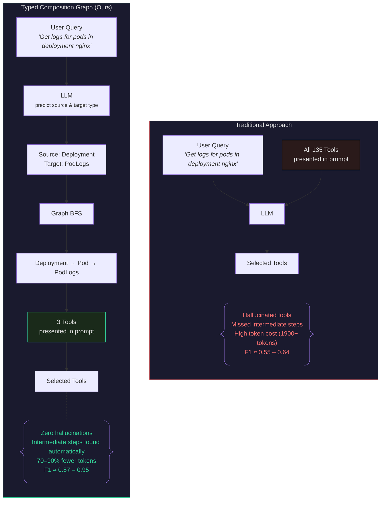

# Approach Overview

```mermaid
graph TB
    subgraph traditional["Traditional Approach"]
        direction TB
        Q1["User Query<br/><i>'Get logs for pods in deployment nginx'</i>"]
        LLM1["LLM"]
        TOOLS["All 135 Tools<br/>presented in prompt"]
        OUT1["Selected Tools"]
        PROB["Problems"]

        Q1 --> LLM1
        TOOLS --> LLM1
        LLM1 --> OUT1

        OUT1 -.- PROB

        PROB@{ shape: braces, label: "Hallucinated tools<br/>Missed intermediate steps<br/>High token cost (1900+ tokens)<br/>F1 ≈ 0.55 – 0.64" }
    end

    subgraph proposed["Typed Composition Graph (Ours)"]
        direction TB
        Q2["User Query<br/><i>'Get logs for pods in deployment nginx'</i>"]
        LLM2["LLM<br/><small>predict source & target type</small>"]
        TYPES["Source: Deployment<br/>Target: PodLogs"]
        GRAPH["Graph BFS"]
        PATH["Deployment → Pod → PodLogs"]
        SMALL["3 Tools<br/>presented in prompt"]
        OUT2["Selected Tools"]
        WIN["Results"]

        Q2 --> LLM2
        LLM2 --> TYPES
        TYPES --> GRAPH
        GRAPH --> PATH
        PATH --> SMALL
        SMALL --> OUT2

        OUT2 -.- WIN

        WIN@{ shape: braces, label: "Zero hallucinations<br/>Intermediate steps found automatically<br/>70–90% fewer tokens<br/>F1 ≈ 0.87 – 0.95" }
    end

    style traditional fill:#1a1a2e,stroke:#f87171,color:#e0e0e0
    style proposed fill:#1a1a2e,stroke:#34d399,color:#e0e0e0
    style PROB color:#f87171
    style WIN color:#34d399
    style TOOLS fill:#2a1a1a,stroke:#f87171,color:#e0e0e0
    style SMALL fill:#1a2a1a,stroke:#34d399,color:#e0e0e0
```
